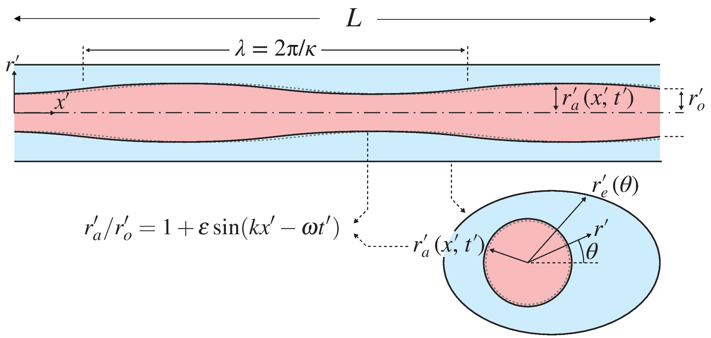

# Peristalsis in perivascular networks 

This repo contains the code used for the results in the manuscript "The directional flow generated by perisalsis in perivascular networks - theoretical and numerical reduced order descriptions" by Ingeborg Gjerde, Marie Rognes and Antonio Sanchez. 

Centrally, the code computes net flow driven by peristalsis. This can be done both analytically and numerically; `simulation/run_comparison.py` validates these two approaches against each other.



# Dependencies


The code is based on models and methods provided in [graphnics](https://github.com/IngeborgGjerde/graphnics), which in turn depends on
  - [FEniCS](https://fenicsproject.org/)
  - [networkx](https://networkx.org/)  

We recommend using the provided docker image for running the code.


# Running the code


### Docker image

The container can be built and run locally by executing

```shell
git clone https://github.com/scientificcomputing/perivascular-peristalsis/tree/main
cd perivascular-peristalsis
docker build --no-cache -t graphnics . # build the docker image
cd ..
docker run --name graphnics-container -v "$(pwd):/home/fenics/shared" -d -p 127.0.0.1:8888:8888 graphnics 'jupyter-notebook --ip=0.0.0.0'
```

Notebooks can then be accessed by executing
```
docker logs graphnics-container
```
and opening the link provided in the output.

To run scripts natively, open a terminal in the container by executing
```shell
docker exec -it graphnics-container /bin/bash
```
and enter the shared folder containing the code
```shell
cd shared
```


### Reproducing the results in the paper

The comparison between the analytical and numerical approach on a single vessel can be run by executing
```shell
python3 simulation/run_comparison.py --betas 2 --Ls 1 --ts_per_cycle 25 --lambdas 0.1 1 2 10 
```
The number of arguments given to `--betas` and `--Ls` determines the number of vessel segments; running e.g. 
```shell
python3 simulation/run_comparison.py --betas 2 2 2 --Ls 1 1 1 --ts_per_cycle 25 --lambdas 0.1 1 2 10 
```
repeats the same experiment on a Y-birucation. 

The simulation of interacting cardiac and vasomotion waves can be run by executing
```shell
python3 simulation/run_interacting_waves.py
```


